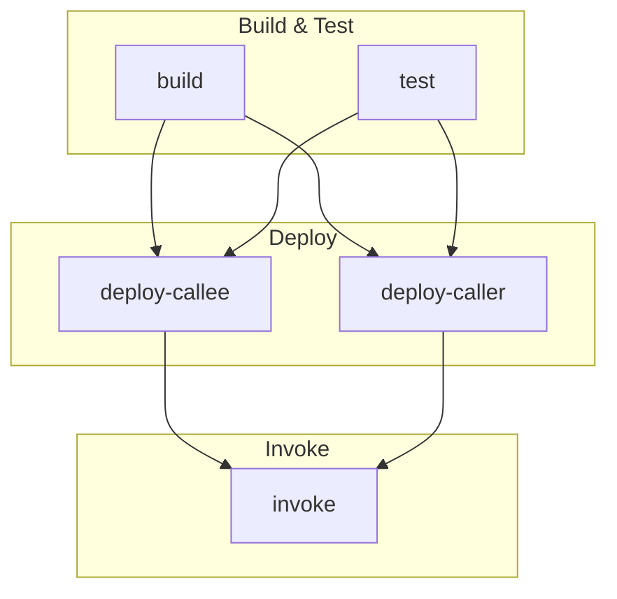

# Partial Fail

A Soroban smart contract example demonstrating graceful error handling using the `try_` variant for cross-contract calls.

## Overview

This project contains two contracts:

- **callee** - A contract with a `call_me` function that always fails with a contract error
- **caller** - A contract that calls the callee using `try_call_me()` to handle the error gracefully

The caller contract logs whether the called contract succeeded or failed, demonstrating how to use the `try_` variant to catch errors from cross-contract calls without panicking.

## Project Structure

```text
.
├── contracts
│   ├── callee              # Contract that always fails
│   │   ├── src
│   │   │   ├── lib.rs
│   │   │   └── test.rs
│   │   └── Cargo.toml
│   ├── callee-interface    # Interface crate with error type and client
│   │   ├── src
│   │   │   └── lib.rs
│   │   └── Cargo.toml
│   └── caller              # Contract that calls callee with try variant
│       ├── src
│       │   ├── lib.rs
│       │   └── test.rs
│       └── Cargo.toml
├── Cargo.toml
└── README.md
```

## Building

```bash
stellar contract build
```

## Testing

```bash
cargo test
```

## How It Works

The `callee-interface` crate defines the contract interface separately from the implementation:

```rust
#[contracterror]
pub enum Error {
    AlwaysFails = 1,
}

#[contractclient(name = "Client")]
pub trait Interface {
    fn call_me(env: Env) -> Result<(), Error>;
}
```

The `caller` contract uses the interface to call the callee:

```rust
pub fn do_something(env: Env, contract: Address) {
    let client = callee_interface::Client::new(&env, &contract);
    match client.try_call_me() {
        Ok(_) => log!(&env, "called contract succeeded"),
        Err(_) => log!(&env, "called contract failed"),
    }
}
```

By using `try_call_me()` instead of `call_me()`, the caller receives a `Result` and can handle the error without the transaction failing.

## CI/CD Pipeline

The project includes a GitHub Actions workflow that builds, tests, deploys, and invokes the contracts on Stellar testnet.

### Pipeline Diagram



### Pipeline Jobs

| Job | Description |
|-----|-------------|
| **build** | Builds contracts with `stellar contract build`, uploads WASM artifacts, and attests them on main branch |
| **test** | Runs `cargo test` to execute unit tests |
| **deploy-callee** | Deploys the callee contract to testnet, outputs contract ID |
| **deploy-caller** | Deploys the caller contract to testnet, outputs contract ID |
| **invoke** | Invokes the caller contract's `do_something` function, passing the callee contract ID |

The build and test jobs run in parallel. The two deploy jobs also run in parallel after build and test complete. Finally, the invoke job runs after both contracts are deployed.

### Example Output

From a recent CI run, here are the deployed contracts on testnet:

- **callee**: [`CC6JHKAQ5BFKOZRHHYTBG24PJRG6XBGPOVEBPUWDYRYUGAJU2F6B7OB6`](https://stellar.expert/explorer/testnet/contract/CC6JHKAQ5BFKOZRHHYTBG24PJRG6XBGPOVEBPUWDYRYUGAJU2F6B7OB6)
- **caller**: [`CBDPHZNEOPE2L32PK72NEZS4JSSQJ2UDQV2LWID7XA7TSXRVO4MR5YCJ`](https://stellar.expert/explorer/testnet/contract/CBDPHZNEOPE2L32PK72NEZS4JSSQJ2UDQV2LWID7XA7TSXRVO4MR5YCJ)

#### Invoke Output

The invoke job calls the caller contract, which in turn calls the callee contract using `try_call_me()`:

```
stellar contract invoke \
  --send yes \
  --id CBDPHZNEOPE2L32PK72NEZS4JSSQJ2UDQV2LWID7XA7TSXRVO4MR5YCJ \
  -- \
  do_something \
  --contract CC6JHKAQ5BFKOZRHHYTBG24PJRG6XBGPOVEBPUWDYRYUGAJU2F6B7OB6
```

The transaction succeeds even though the callee contract fails, because the caller uses `try_call_me()` to catch the error gracefully.

Example invoke transaction: [`38d69089a10eba0eb5e20c3867d16ea775090b03261b93c56c051e714ec7bd86`](https://stellar.expert/explorer/testnet/tx/38d69089a10eba0eb5e20c3867d16ea775090b03261b93c56c051e714ec7bd86)
