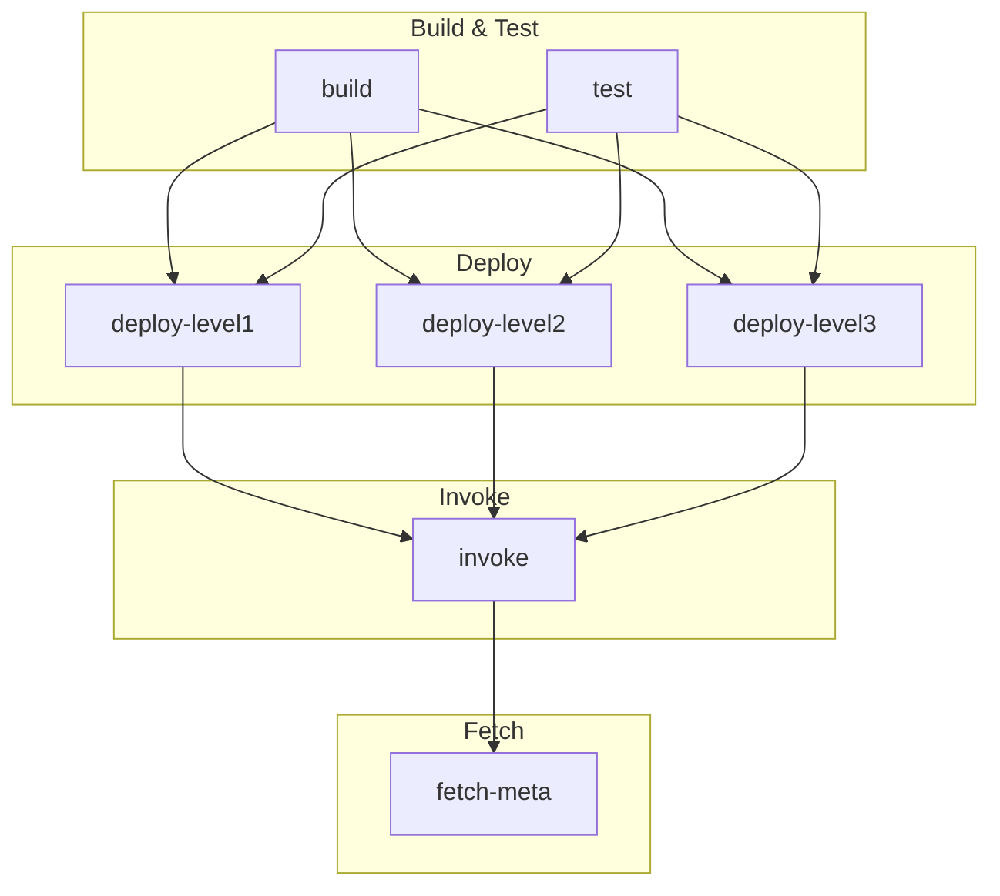

# Partial Fail

A Soroban smart contract example demonstrating graceful error handling using the `try_` variant for cross-contract calls.

## Overview

This project contains three contracts in a call chain:

- **level1** - The top-level contract that calls level2 using `try_call_me()` to handle errors gracefully
- **level2** - A contract that calls level3, then always fails with a contract error
- **level3** - A contract with a `do_work` function that succeeds

The call chain is: level1 -> level2 -> level3

When level1 invokes level2:
1. level2 calls level3's `do_work()` which succeeds
2. level2 then returns an error
3. level1 catches the error using `try_call_me()` without panicking

This demonstrates how to use the `try_` variant to catch errors from cross-contract calls.

## Project Structure

```text
.
├── contracts
│   ├── level1              # Top-level contract (catches errors)
│   │   ├── src
│   │   │   ├── lib.rs
│   │   │   └── test.rs
│   │   └── Cargo.toml
│   ├── level2              # Middle contract (calls level3, then fails)
│   │   ├── src
│   │   │   ├── lib.rs
│   │   │   └── test.rs
│   │   └── Cargo.toml
│   ├── level2-interface    # Interface crate with error type and client
│   │   ├── src
│   │   │   └── lib.rs
│   │   └── Cargo.toml
│   ├── level3              # Innermost contract (succeeds)
│   │   ├── src
│   │   │   ├── lib.rs
│   │   │   └── test.rs
│   │   └── Cargo.toml
│   └── level3-interface    # Interface crate for level3
│       ├── src
│       │   └── lib.rs
│       └── Cargo.toml
├── Cargo.toml
└── README.md
```

## Building

```bash
stellar contract build
```

## Testing

```bash
cargo test
```

## How It Works

The `level2-interface` crate defines the contract interface separately from the implementation:

```rust
#[contracterror]
pub enum Error {
    AlwaysFails = 1,
}

#[contractclient(name = "Client")]
pub trait Interface {
    fn call_me(env: Env, level3: Address) -> Result<(), Error>;
}
```

The `level1` contract uses the interface to call level2:

```rust
pub fn do_something(env: Env, level2: Address, level3: Address) {
    let client = level2_interface::Client::new(&env, &level2);
    match client.try_call_me(&level3) {
        Ok(_) => log!(&env, "level2 succeeded"),
        Err(_) => log!(&env, "level2 failed"),
    }
}
```

By using `try_call_me()` instead of `call_me()`, level1 receives a `Result` and can handle the error without the transaction failing.

## CI/CD Pipeline

The project includes a GitHub Actions workflow that builds, tests, deploys, and invokes the contracts on Stellar testnet.

### Pipeline Diagram



### Pipeline Jobs

| Job | Description |
|-----|-------------|
| **build** | Builds contracts with `stellar contract build`, uploads WASM artifacts, and attests them on main branch |
| **test** | Runs `cargo test` to execute unit tests |
| **deploy-level1** | Deploys the level1 contract to testnet, outputs contract ID |
| **deploy-level2** | Deploys the level2 contract to testnet, outputs contract ID |
| **deploy-level3** | Deploys the level3 contract to testnet, outputs contract ID |
| **invoke** | Invokes level1's `do_something` function, passing level2 and level3 contract IDs |
| **fetch-meta** | Fetches the transaction meta from the invoke transaction |

The build and test jobs run in parallel. The three deploy jobs also run in parallel after build and test complete. The invoke job runs after all contracts are deployed, and fetch-meta runs after invoke.
